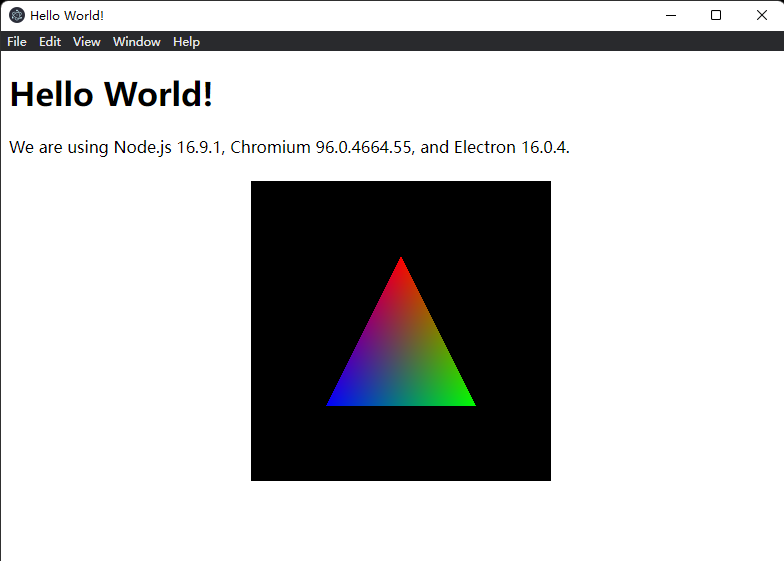

Draw a triangle inside Electron's window using DirectX 11, mixing web and native content.



## Limitations

The native content is rendered over a child window, rather than embedded into the web page. It won't be affected by any web content.

## Requirement

- Visual Studio with C++ support
- CMake
- NodeJS & npm

## Build & Run

Build the native code

```
mkdir build && cd build
cmake ..
cmake --build .
```

Install Electron and run the application

```
npm install
npm start
```
