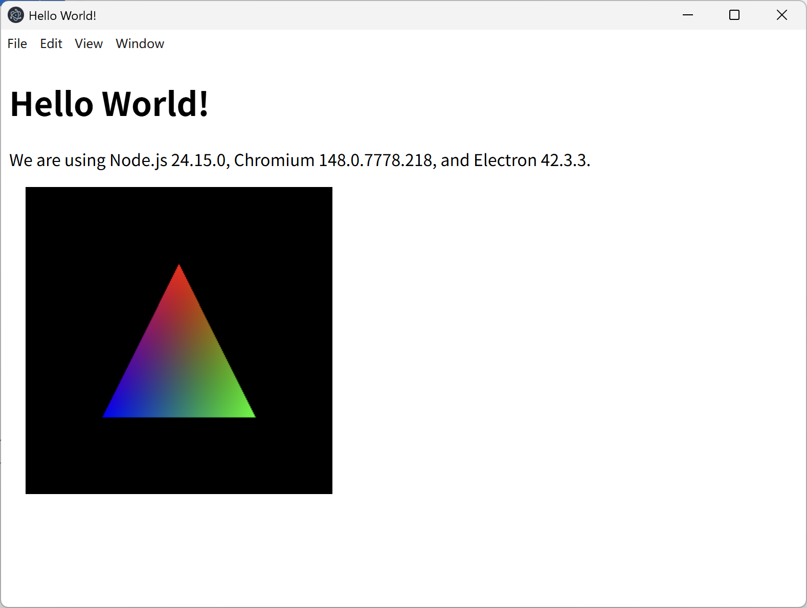

Draw a triangle inside Electron's window using DirectX 11, mixing web and native content.

By using Electron's [`SharedTexture`](https://github.com/electron/electron/blob/v42.3.3/shell/common/api/shared_texture/README.md) API, we can render to an HTML canvas externally.



## Requirements

- Visual Studio with C++ support
- NodeJS & npm

## Build & Run

Build the native code (run in **x64 Native Tools Command Prompt for VS**):

```
mkdir build
cl /EHsc /Fo:.\build\ /Fe:build\my-renderer.exe native\main.cpp
```

Install Electron and run the application

```
npm install
npm start
```
